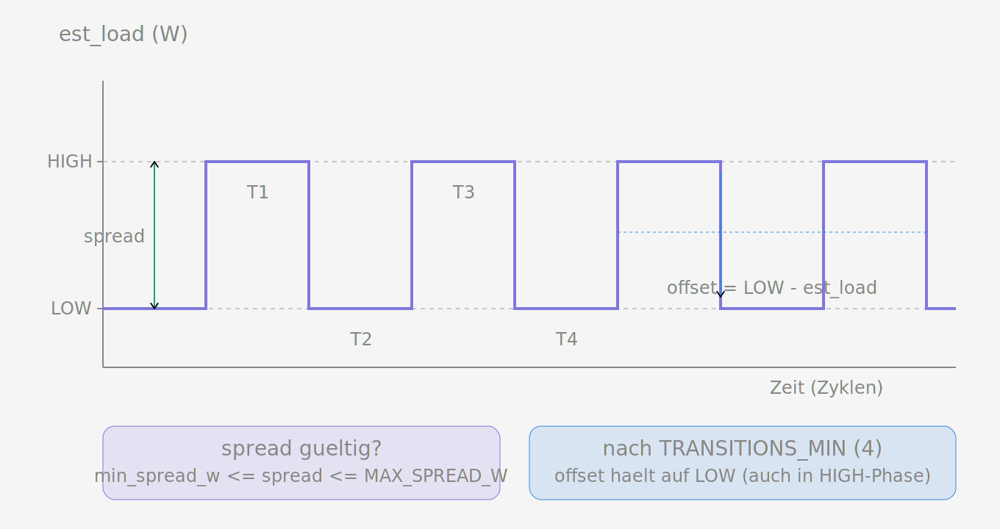
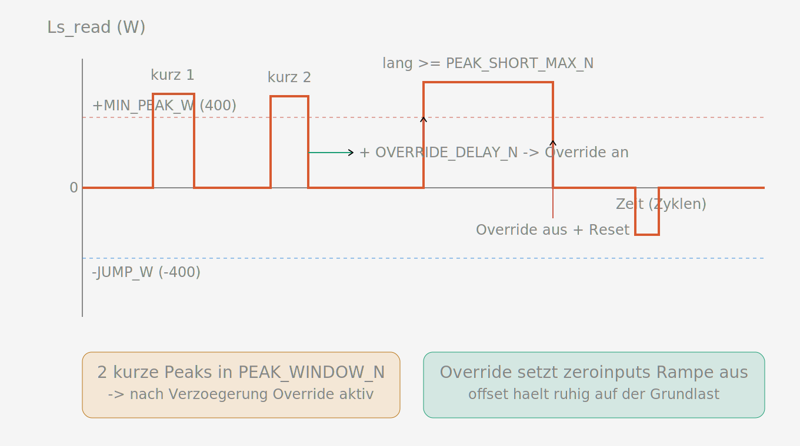

# zeroinput Lastprediktor — Spezifikation

Funktionsspezifikation des zeroinput-Lastprediktors (`predictor.py`, VERSION 107). Dies ist die maßgebliche Beschreibung des Soll-Verhaltens. Die englische Fassung ist `predictor_spec_en.md`.

## Zweck

Der Prediktor liefert einen `offset` (in Watt), den zeroinput zur Bedarfsberechnung addiert. Er verbessert die Nulleinspeise-Regelung für zwei Lastmuster, die der reine Regelkreis schlecht beherrscht:

1. **Zyklische Lasten** (z.B. ein Waschmaschinenmotor oder eine thermostatgetaktete Heizdecke), die zwischen zwei Leistungsniveaus wechseln. Der Prediktor lernt die Niveaus und hält den Wechselrichter auf dem unteren, so dass dieser dem Zyklus nicht hinterherläuft und in die Einspeisung überschießt.
2. **Wiederkehrende kurze Hochlast-Spitzen** („Peaks"), bei denen die gesetzlich begrenzte Rampengeschwindigkeit des Wechselrichters dazu führt, dass sein Hochregeln mehr Energie einspeist als die Spitze je sparen könnte. Der Prediktor erkennt die Wiederholung und sitzt die Spitzen aus, statt ihnen zu folgen.

Im frischen Zustand erhöht der Prediktor nie das Einspeiserisiko: solange nichts gelernt ist (und kein Override aktiv ist), ist der offset 0 und wird nie aktiv angewendet.

## Motivation

Überschießende Einspeisung zu vermeiden lohnt sich, weil die Batterie nur selten voll wird: PV-Energie ist damit fast nie echter Überschuss, sondern könnte gespeichert und später selbst genutzt werden. Was stattdessen — oft unvergütet — ins Netz fließt, ist verschenkte Energie. Jede vermiedene Einspeisung erhöht den Anteil der wirksam selbst genutzten Energie und senkt so den Netzbezug; das ist die messbare Wirkung des Prediktors. Ein ruhigerer Arbeitspunkt könnte zudem die Wechselrichter schonen.

## Schnittstelle

zeroinput benötigt:

- `update(Ls_read, last2_send) -> offset` — einmal pro Regelzyklus aufgerufen.
- `reload_conf(conf)` — Hot-Reload von `load_prediction` (bool) und `min_spread_w` (int).
- `status(predictive_offset) -> str` — lesbare Statuszeile.
- Attribute `enabled`, `offset`, `ramp_override_by_predictor`.
- Logging-Infrastruktur: `_log_path`, `_log_fh`, `_log_open()`, `verbose`.

`Ls_read` ist der Zählerwert (positiv = Netzbezug, negativ = Einspeisung). `last2_send` ist der Wechselrichter-Sendewert von vor zwei Zyklen. `est_load = Ls_read + last2_send` ist die geschätzte tatsächliche Hauslast.

## Zeitmodell: Zyklen statt Sekunden

Alle Zeitgrößen werden in **Zyklen** gezählt — ein `update()`-Aufruf ist ein Zyklus. Der Regelkreis läuft etwa mit einem Zyklus pro Sekunde, daher lassen sich die Konstantenwerte weiterhin natürlich als Sekunden lesen, aber die Zählung ist exakt und unabhängig von Schwankungen der Schleifenzeit. (Eine frühere sekundenbasierte Variante verfehlte einen Schwellwert, wenn die Zyklen nicht exakt eine Sekunde auseinanderlagen.) Die Wanduhrzeit wird nur für den Log-Zeitstempel verwendet.

## Konstanten

Gemeinsam:

| Konstante | Wert | Bedeutung |
|---|---|---|
| `NEAR_ZERO_W` | 50 | `|Ls_read|` ≤ dieser Wert gilt als „nahe null" (ruhig) |

k-Means:

| Konstante | Wert | Bedeutung |
|---|---|---|
| `min_spread_w` | config | minimaler Spread zwischen LOW und HIGH |
| `MAX_SPREAD_W` | 400 | maximaler Spread für ein gültiges zyklisches Muster |
| `TRANSITIONS_MIN` | 4 | Phasenwechsel, bevor der offset aktiv wird |
| `MIN_HIST` | 10 | Samples, bevor k-Means überhaupt rechnet |
| `MAX_HIST` | 60 | Länge des History-Puffers (Samples) |
| `KMEANS_TIMEOUT_N` | 120 | Zyklen ohne echte Transition → gelernte Niveaus verwerfen |
| `JUMP_W` | 400 | `Ls_read` unter −dieser Wert (ohne vorausgehenden Peak) = Last weg |

Peaks & Override:

| Konstante | Wert | Bedeutung |
|---|---|---|
| `MIN_PEAK_W` | 400 | `Ls_read` darüber = Peak; auf/darunter = Peak beendet |
| `PEAK_SHORT_MAX_N` | 8 | < dieser Wert = kurzer Peak; ≥ = langer Peak |
| `PEAK_WINDOW_N` | 120 | Fenster für die zwei Peaks; auch Override-Timeout |
| `PEAK_LIFETIME_N` | 120 | wie lange ein beendeter kurzer Peak gezählt wird |
| `OVERRIDE_DELAY_N` | 12 | Zyklen nach Ende des 2. Peaks bis Override aktiv |
| `BASE_CYCLES` | 10 | Nicht-Peak-Zyklen für die Mittelung des Halteziels |

## Mechanismus 1: k-Means (zyklische Last)

Die verlässliche Basis. k-Means clustert die Lasthistorie in zwei Niveaus, LOW und HIGH. Es rechnet erst, sobald mindestens `MIN_HIST` (10) Samples vorliegen. Ein Ergebnis ist nur gültig, wenn der Spread (`HIGH − LOW`) im Bereich `[min_spread_w, MAX_SPREAD_W]` liegt **und** die Verteilung wirklich zweistufig ist: enthält eine der beiden Cluster-Gruppen weniger als 15 % (oder mehr als 85 %) der Werte, gilt sie als unimodal und wird verworfen — dann gibt es keine gültigen Niveaus.

Liefert k-Means kein gültiges Ergebnis (unimodale History oder Spread außerhalb der Grenzen), werden die gespeicherten Niveaus sofort verworfen (LOW/HIGH, Phase und Transition-Zähler zurückgesetzt). Veraltete Niveaus dürfen nicht bestehen bleiben, sobald das zyklische Muster verschwunden ist — sonst hielte der offset weiter auf einem nicht mehr existierenden LOW und erzeugte dauerhaften Netzbezug. Die History bleibt dabei erhalten, sodass beim Wiederkehren des Pendelns ohne Verzögerung neu gelernt wird.

Die aktuelle Phase ergibt sich aus dem Mittelpunkt der beiden Niveaus: liegt `est_load` unter `(LOW + HIGH) / 2`, ist die Phase LOW, sonst HIGH. Ein **Transition** ist ein Wechsel dieser Zuordnung zwischen LOW und HIGH. Nach `TRANSITIONS_MIN` (4) Transitionen wird der offset aktiv und hält den Wechselrichter auf LOW (`offset = LOW − est_load`). Es gibt keine Anlaufverzögerung; die History baut sich sofort auf.

### down-Abbruch

Fällt `Ls_read < −JUMP_W` (starke Einspeisung: eine Last ist weggefallen) **ohne vorausgehenden Peak**, wird k-Means sofort zurückgesetzt — die gelernten Niveaus werden verworfen und das Lernen beginnt neu. Die Ausnahme „vorausgehender Peak" unterscheidet einen echten Lastwegfall von der Trägheits-Einspeisespitze, die jedem Peak folgt (siehe unten). Diese Regel gilt immer, auch während ein Override aktiv ist.

### k-Means-Timeout

Vergehen `KMEANS_TIMEOUT_N` (120) Zyklen ohne echte LOW↔HIGH-Transition, werden die gelernten Niveaus verworfen (die zyklische Last ist offenbar vorbei). Ein Peak zählt **nicht** als Transition und setzt diesen Timer nicht zurück — nur ein echter Phasenwechsel tut das. Der Timeout verwirft **nur** die Niveaus; läuft ein Override, bleibt dieser bestehen (er fällt dann auf das Halteziel aus dem Grundlast-Mittel zurück).

## Mechanismus 2: Peaks & Override

Dieser Mechanismus behandelt wiederkehrende kurze Hochlast-Spitzen (Peaks), etwa von einem taktenden Verbraucher. Der **Override** ist ein Signal des Prediktors an zeroinput, dessen Rampenmodus auszusetzen (Flag `ramp_override_by_predictor`): Normalerweise fährt zeroinput große Lastsprünge über eine eigene Rampe ab und überschreibt dabei den Prediktor-Offset. Bei einem erkannten taktenden Verbraucher würde diese Rampe bei jedem Peak den offset verfälschen — der Override unterbindet sie, damit der Prediktor den offset ruhig auf der Grundlast halten und die Peaks aussitzen kann.

### Peak-Erkennung und -Dauer

Ein Peak läuft, solange `Ls_read > MIN_PEAK_W`, und endet, sobald `Ls_read ≤ MIN_PEAK_W` — dieselbe Regel in allen Fällen. Die Peak-Dauer ist die Anzahl Zyklen von Beginn bis Ende.

- **langer Peak** (≥ `PEAK_SHORT_MAX_N`, 8 Zyklen): wird in Echtzeit klassifiziert, sobald die Schwelle erreicht ist, noch während der Peak läuft. Ein langer Peak löst einen k-Means-Reset aus (und beendet einen aktiven Override).
- **kurzer Peak** (< `PEAK_SHORT_MAX_N` Zyklen): erst am Peak-Ende beweisbar. Ein kurzer Peak zählt zur Override-Aktivierung.

Der Wert von `PEAK_SHORT_MAX_N` sollte an die eigene Anlage und die eigenen Erwartungen angepasst werden.

### Peak-Behandlung gegenüber k-Means

- Jedes Peak-Sample wird in der History durch das Niveau der Phase ersetzt, in der der Peak begann (LOW oder HIGH); die History-Länge bleibt unverändert. Das Rechtecksignal wird über den Peak flach weitergehalten. Seltene Phasenwechsel während eines kurzen Peaks werden ignoriert (ein kurzer Peak ist viel kürzer als eine Phase).
- **Override noch nicht aktiv (Phase A):** ein Peak pausiert den offset (gelernte Niveaus bleiben, der Transition-Zähler läuft neu; nach 4 erneuten Transitionen läuft der offset wieder an). Sind noch keine Niveaus gelernt, setzt ein Peak k-Means zurück.
- **Override aktiv:** ein kurzer Peak pausiert nichts mehr — der offset läuft unverändert weiter, der Peak wird nur aus dem Lernen herausgehalten.

### Override-Aktivierung

Zwei kurze Peaks innerhalb `PEAK_WINDOW_N` (120 Zyklen) bereiten den Override vor. Nach dem Ende des zweiten Peaks (`Ls_read ≤ 400`) wartet der Prediktor `OVERRIDE_DELAY_N` (12 Zyklen); dann wird der Override aktiv. Ein frischer Peak bricht eine ausstehende Vorbereitung ab.

### Override-Halteziel

Während der Override aktiv ist, hält der offset:

- auf dem k-Means-LOW, falls eines bekannt ist (`offset = LOW − est_load`, identisch zum normalen k-Means-offset — der Override ändert nur das Peak-Verhalten, nicht die Formel);
- sonst auf dem gleitenden Mittelwert von `est_load` über die letzten `BASE_CYCLES` (10) Nicht-Peak-Zyklen (die Grundlast). `est_load` ist die gemessene Gesamtlast; das Mittel wird in jedem Nicht-Peak-Zyklus fortgeschrieben, unabhängig davon, ob `Ls_read` schon nahe null ist. So folgt das Halteziel einer veränderten Grundlast (neuen „Nulllinie"), statt auf einem alten Wert einzufrieren, solange der offset `Ls_read` noch nicht auf null gefahren hat.

### Override-Ende

Der Override endet bei einem langen Peak (≥ 10 Zyklen) oder nach `PEAK_WINDOW_N` (120 Zyklen) ohne jeden Peak; danach fällt der Prediktor in den normalen k-Means-Betrieb zurück.

## Reset-Semantik

Ein k-Means-Reset löscht die gelernten Niveaus, die History, die Phase und den Transition-Zähler. Standardmäßig beendet ein Reset **auch** den Override: er löscht das Override-Flag, die ausstehende Vorbereitung, den Grundlast-Puffer, die Liste der kurzen Peaks (`short_peaks`) und den laufenden Peak-Zustand — ein vollständiger Neustart. So kann eine alte Peak-Historie nach dem Reset keine ungewollte erneute Override-Aktivierung auslösen. Das gilt für den Reset durch langen Peak und für den down-Abbruch. Die einzige Ausnahme ist der k-Means-Timeout, der nur die Niveaus verwirft und Override, Grundlast-Puffer und Peak-Historie unangetastet lässt (ein laufender Override wird fortgesetzt).

Die down-Abbruch-Aussetzung (`peak_after`) ist bedingungs- und nicht zeitbasiert: nach einem Peak-Ende bleibt sie wirksam, bis `Ls_read` wieder nahe null ist, damit die Trägheits-Einspeisespitze des Peaks keinen falschen down-Abbruch auslöst. Ein erneuter Abfall unter −`JUMP_W` aus dem ruhigen Zustand ist ein echter Lastwegfall.

## Frischer Start und Aktivierung

Im frischen Zustand ist der offset 0 und wird nie aktiv angewendet, bis etwas gelernt ist oder ein Override aktiviert wird. Wechselt `load_prediction` per config von aus auf ein, wird der gesamte Zustand für einen frischen Lernstart gelöscht (das geschieht nicht bei jedem Reload, nur beim Übergang aus→ein).

## Statuszeile

`status()` meldet die Version, die gelernten Niveaus und die Phase (oder `learning hist=N`), eine `OVERRIDE`-Markierung bei aktivem Override, ein laufendes `peak Nc` während ein Peak läuft und die Liste lebender kurzer Peaks als `[Dauer/Restzeit]` pro Peak, z.B. `[4c/92c, 5c/103c]` — Dauer und verbleibende Lebensdauer in Zyklen. Das abschließende `offset=N` ist der in diesem Zyklus gelieferte Wert.

## Log

Das Predictor-Log ist als Diagnose- und Analyse-Schnittstelle gedacht, nicht als Betriebsanzeige: Das laufende Monitoring der Anlage erfolgt über Volkszähler, während dieses Log mit seinem hohen Detailgrad der späteren Fehlersuche dient (etwa wenn ein Auszug zur Analyse herangezogen wird). Daher protokolliert es jeden internen Zustand pro Zyklus.

Der Prediktor hängt pro Zyklus eine tab-getrennte Zeile an `LOG_FILE` an (standardmäßig `/tmp/predictor.log`, über `predictor_log` konfigurierbar). Beim Öffnen werden ein Versionsbanner und der Spaltenkopf geschrieben; `# RESET` / `# ENABLE`-Markerzeilen halten Zustandswechsel fest (die `# RESET`-Zeile nennt die Predictor-Version). Spalten: Zeitstempel, Zeit, Ls_read, last2_send, est_load, History-Länge, LOW, HIGH, Spread, Phase, Transition-Zähler, offset, Override-Flag, verbleibende Override-Zyklen, In-Peak-Flag, Peak-Alter (Zyklen), Anzahl kurzer Peaks.
