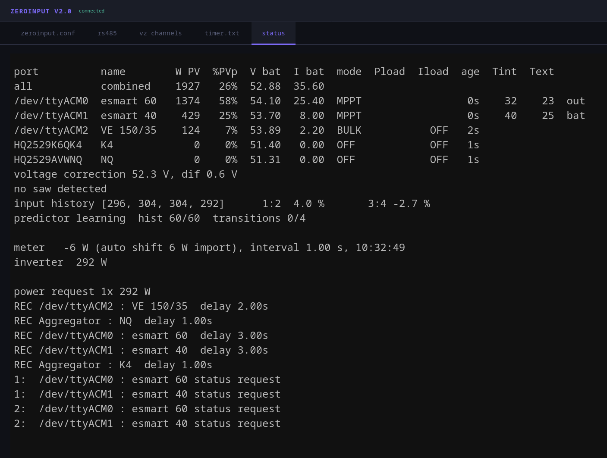
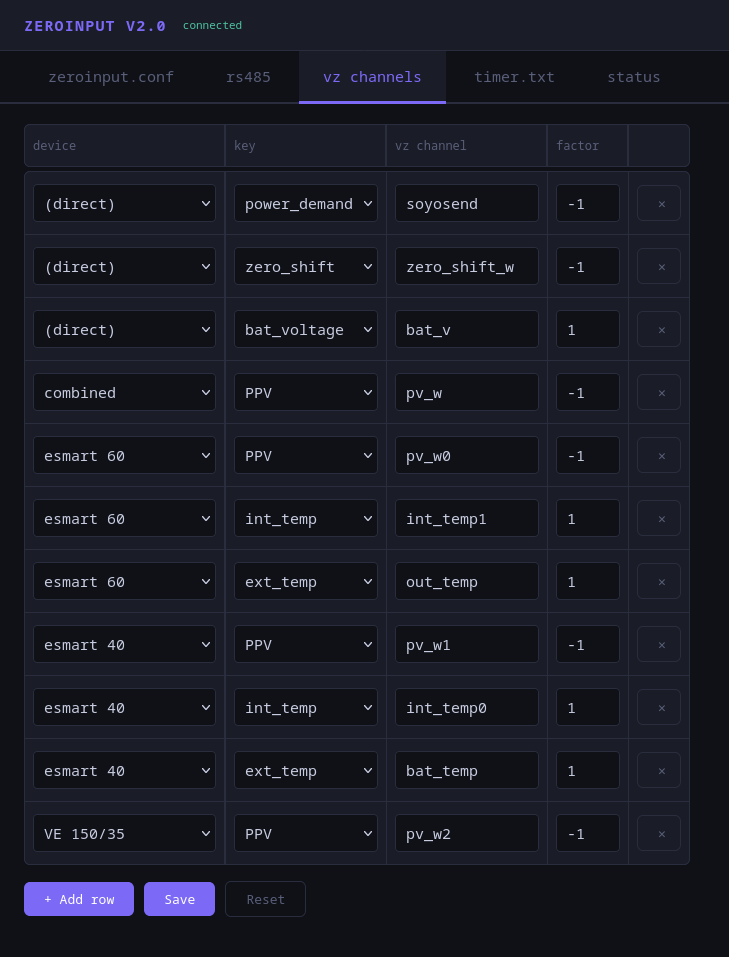
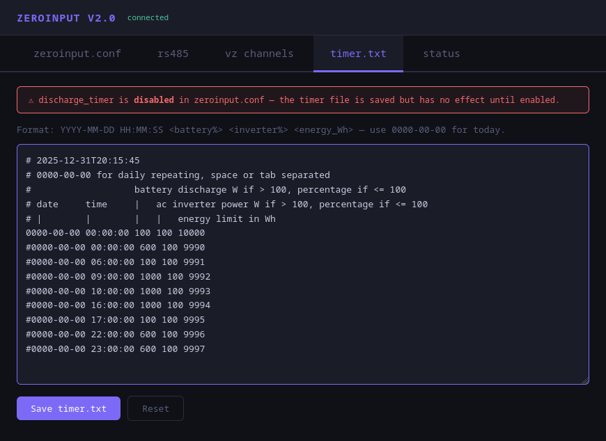
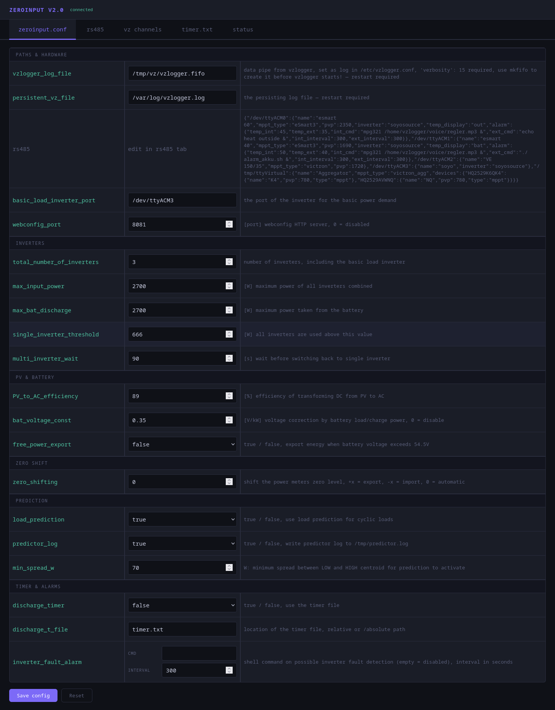
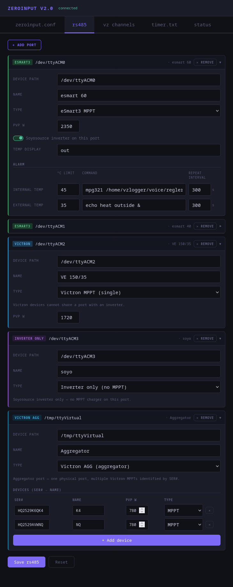

# Predictor
## low phase
Washing machine: spin cycle, motor on/off/on/off, predictor kicks in

## peak override
Override is active, short peaks shaved, long peak deactivates override, 2 short peaks re-activate override

# webconfig
## status

## vzchannels

## timer

**outdated:**
## general config

## devices

