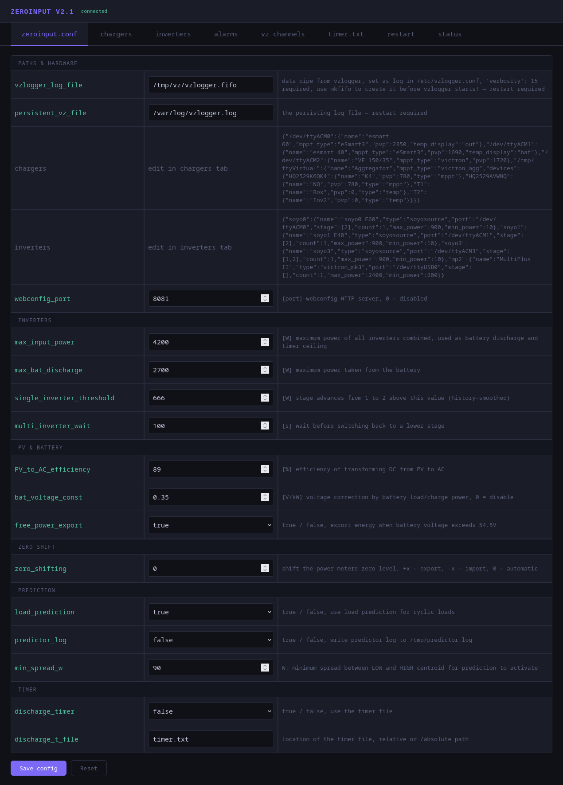
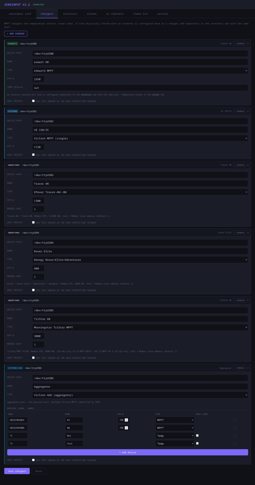
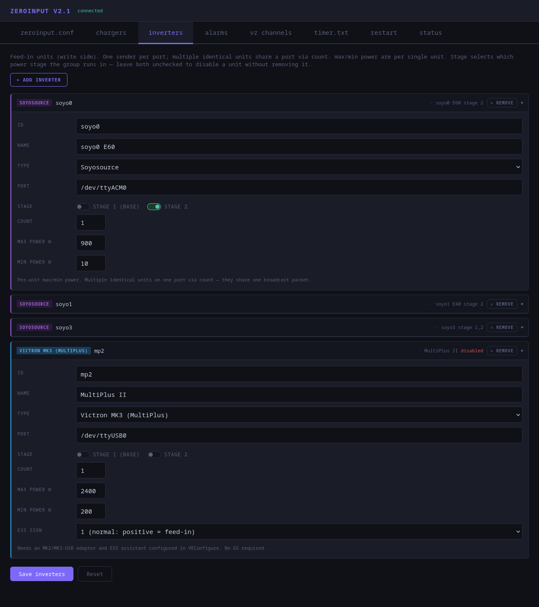
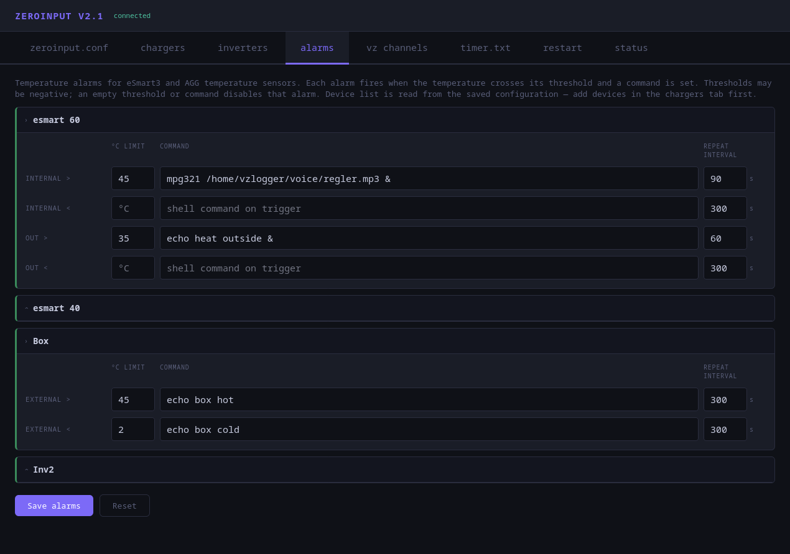
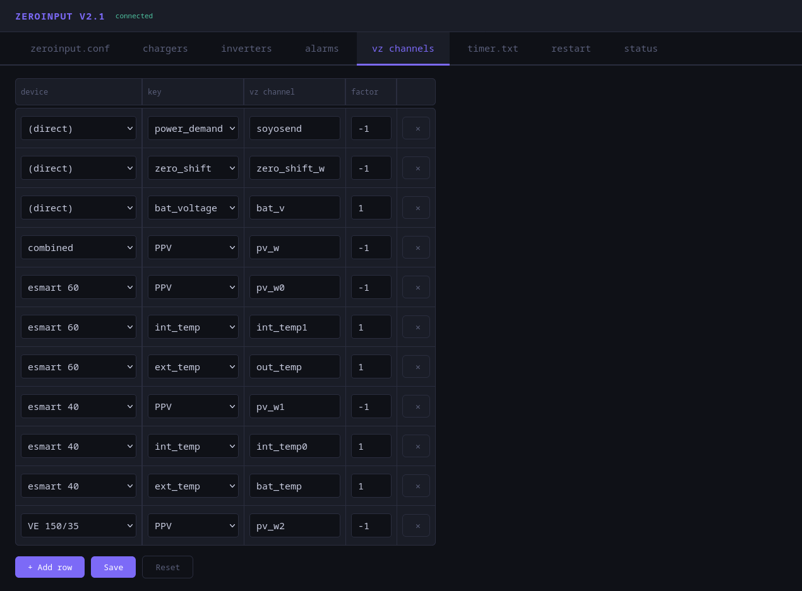
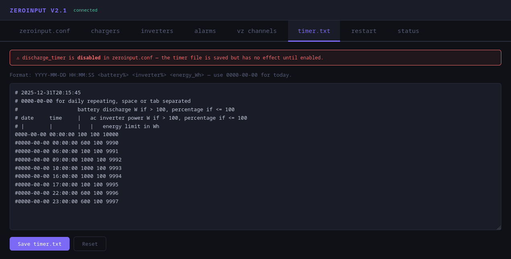
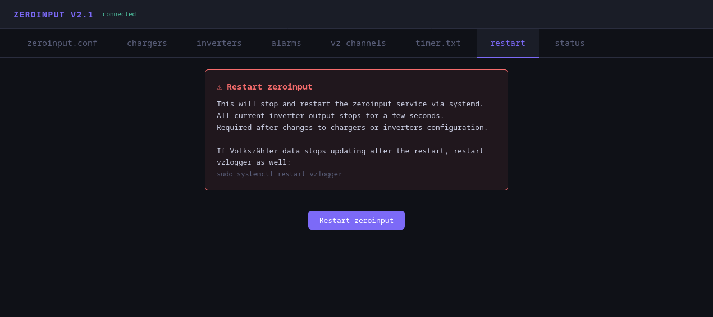
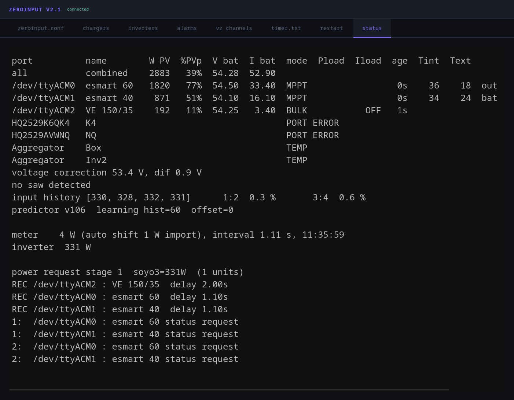
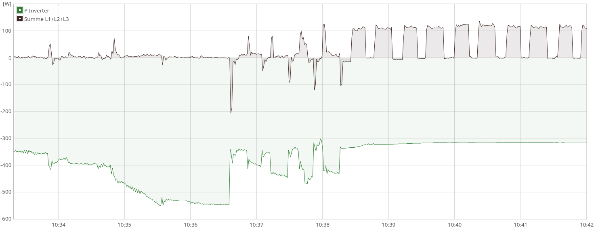
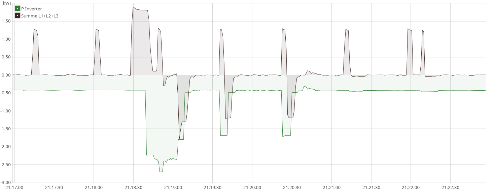

# webconfig
## zeroinput.conf

## chargers

## inverters

## alarms

## vz channels

## timer.txt

## restart

## status

# Predictor
## low phase
Washing machine: spin cycle, motor on/off/on/off, predictor kicks in

## peak override
Override is active, short peaks shaved, long peak deactivates override, 2 short peaks re-activate override

